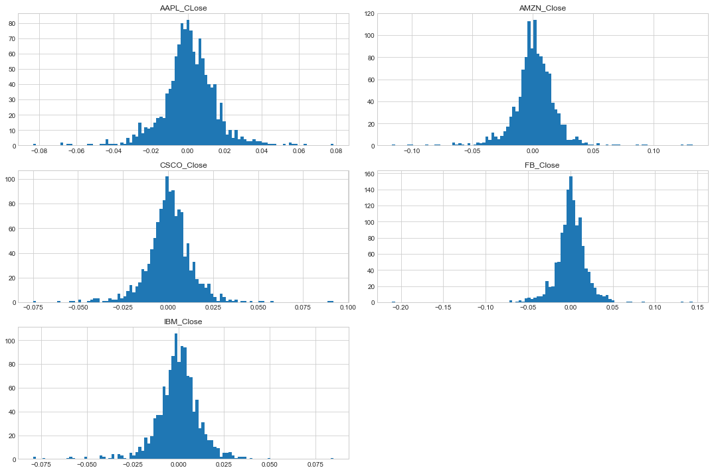

In this project, an effort has been made in order to figure out the best portfolio by maximizing a portfolios expected return. The same had been accomplished by reducing the negative sharpe ratio as much as possible.

Below python libraries have been imported.

```python
import quandl
import numpy as np
import pandas as pd
import seaborn as sns
import matplotlib.pyplot as plt
from pandas_datareader import data as wb
from __future__ import division
from pandas import Series,DataFrame
sns.set_style('whitegrid')
%matplotlib inline
```
A portfoilio of technical stocks have beem made up using data reader libraries of python

```python
from datetime import datetime
bank_list = ['AAPL','CSCO','IBM','AMZN','FB']
end = datetime.now()
start = datetime(end.year-5,end.month,end.day)

for x in bank_list:
    globals()[x] = wb.DataReader(x,'yahoo',start,end)
```

**combine_close** is the dataframe which is the ammalgamation of the close price of all other stocks. The same is known as 

```python
combine_close = pd.concat([AAPL['Adj Close'],CSCO['Adj Close'],IBM['Adj Close'],AMZN['Adj Close'],FB['Adj Close']],axis=1)
combine_close.columns = ['AAPL_CLose', 'CSCO_Close', 'IBM_Close', 'AMZN_Close', 'FB_Close']
combine_close.head()
```
<table border="1" class="dataframe">
  <thead>
    <tr style="text-align: right;">
      <th></th>
      <th>AAPL_CLose</th>
      <th>CSCO_Close</th>
      <th>IBM_Close</th>
      <th>AMZN_Close</th>
      <th>FB_Close</th>
    </tr>
    <tr>
      <th>Date</th>
      <th></th>
      <th></th>
      <th></th>
      <th></th>
      <th></th>
    </tr>
  </thead>
  <tbody>
    <tr>
      <th>2013-11-18</th>
      <td>63.056896</td>
      <td>18.128832</td>
      <td>152.086441</td>
      <td>366.179993</td>
      <td>45.830002</td>
    </tr>
    <tr>
      <th>2013-11-19</th>
      <td>63.168758</td>
      <td>18.239531</td>
      <td>152.729507</td>
      <td>364.940002</td>
      <td>46.360001</td>
    </tr>
    <tr>
      <th>2013-11-20</th>
      <td>62.615551</td>
      <td>18.077736</td>
      <td>152.680054</td>
      <td>362.570007</td>
      <td>46.430000</td>
    </tr>
    <tr>
      <th>2013-11-21</th>
      <td>63.362068</td>
      <td>18.282106</td>
      <td>151.806137</td>
      <td>368.920013</td>
      <td>46.700001</td>
    </tr>
    <tr>
      <th>2013-11-22</th>
      <td>63.199150</td>
      <td>18.273592</td>
      <td>149.472977</td>
      <td>372.309998</td>
      <td>46.230000</td>
    </tr>
  </tbody>
</table>
</div>

Below is the plot of *combine_close* dataframe which includes below mentioned share prices.

```python
combine_close.plot(figsize=(15,6), legend=True)
```


**Normed Return** column has been added to the dataframe **stock_df**

```python
for stock_df in (AAPL,CSCO,IBM,AMZN,FB):
    stock_df['Normed Return'] = stock_df['Adj Close'] / stock_df.iloc[0]['Adj Close']
```
<table border="1" class="dataframe">
  <thead>
    <tr style="text-align: right;">
      <th></th>
      <th>High</th>
      <th>Low</th>
      <th>Open</th>
      <th>Close</th>
      <th>Volume</th>
      <th>Adj Close</th>
      <th>Normed Return</th>
    </tr>
    <tr>
      <th>Date</th>
      <th></th>
      <th></th>
      <th></th>
      <th></th>
      <th></th>
      <th></th>
      <th></th>
    </tr>
  </thead>
  <tbody>
    <tr>
      <th>2013-11-18</th>
      <td>373.489990</td>
      <td>364.670013</td>
      <td>370.279999</td>
      <td>366.179993</td>
      <td>2737400</td>
      <td>366.179993</td>
      <td>1.000000</td>
    </tr>
    <tr>
      <th>2013-11-19</th>
      <td>368.779999</td>
      <td>362.500000</td>
      <td>365.820007</td>
      <td>364.940002</td>
      <td>1904800</td>
      <td>364.940002</td>
      <td>0.996614</td>
    </tr>
    <tr>
      <th>2013-11-20</th>
      <td>367.559998</td>
      <td>360.450012</td>
      <td>367.559998</td>
      <td>362.570007</td>
      <td>1771500</td>
      <td>362.570007</td>
      <td>0.990142</td>
    </tr>
    <tr>
      <th>2013-11-21</th>
      <td>369.250000</td>
      <td>363.299988</td>
      <td>364.049988</td>
      <td>368.920013</td>
      <td>1964600</td>
      <td>368.920013</td>
      <td>1.007483</td>
    </tr>
    <tr>
      <th>2013-11-22</th>
      <td>374.500000</td>
      <td>366.309998</td>
      <td>370.000000</td>
      <td>372.309998</td>
      <td>2965500</td>
      <td>372.309998</td>
      <td>1.016740</td>
    </tr>
  </tbody>
</table>
</div>

Column **ALLocation** has been added with a view to calculate the allocation of the stocks in the portfolio.

```python
for stock_df, allo in zip((AAPL,CSCO,IBM,AMZN,FB),[0.4,0.2,0.1,0.05,0.25]):
    stock_df['Allocation'] = stock_df['Normed Return']*allo
AAPL.head()
```

<table border="1" class="dataframe">
  <thead>
    <tr style="text-align: right;">
      <th></th>
      <th>High</th>
      <th>Low</th>
      <th>Open</th>
      <th>Close</th>
      <th>Volume</th>
      <th>Adj Close</th>
      <th>Normed Return</th>
      <th>Allocation</th>
    </tr>
    <tr>
      <th>Date</th>
      <th></th>
      <th></th>
      <th></th>
      <th></th>
      <th></th>
      <th></th>
      <th></th>
      <th></th>
    </tr>
  </thead>
  <tbody>
    <tr>
      <th>2013-11-18</th>
      <td>75.312859</td>
      <td>74.028572</td>
      <td>74.998573</td>
      <td>74.089996</td>
      <td>61236000.0</td>
      <td>63.056896</td>
      <td>1.000000</td>
      <td>0.400000</td>
    </tr>
    <tr>
      <th>2013-11-19</th>
      <td>74.768570</td>
      <td>73.995712</td>
      <td>74.147141</td>
      <td>74.221428</td>
      <td>52234700.0</td>
      <td>63.168758</td>
      <td>1.001774</td>
      <td>0.400710</td>
    </tr>
    <tr>
      <th>2013-11-20</th>
      <td>74.345711</td>
      <td>73.475716</td>
      <td>74.175713</td>
      <td>73.571426</td>
      <td>48479200.0</td>
      <td>62.615551</td>
      <td>0.993001</td>
      <td>0.397200</td>
    </tr>
    <tr>
      <th>2013-11-21</th>
      <td>74.458572</td>
      <td>73.381432</td>
      <td>73.942856</td>
      <td>74.448570</td>
      <td>65506700.0</td>
      <td>63.362068</td>
      <td>1.004840</td>
      <td>0.401936</td>
    </tr>
    <tr>
      <th>2013-11-22</th>
      <td>74.594284</td>
      <td>74.075714</td>
      <td>74.217140</td>
      <td>74.257141</td>
      <td>55931400.0</td>
      <td>63.199150</td>
      <td>1.002256</td>
      <td>0.400902</td>
    </tr>
  </tbody>
</table>
</div>


Below is the allocation of the stocks in 1 million. 

```python
for stock_df in (AAPL,CSCO,IBM,AMZN,FB):
    stock_df['Position Values'] = stock_df['Allocation'] * 100000
```

Below is the dataframe with the **Position Values** of all the stocks.

```python
all_post_vals = pd.concat([AAPL['Position Values'],CSCO['Position Values'],IBM['Position Values'],AMZN['Position Values'],FB['Position Values']],axis=1)
all_post_vals.columns = ['AAPL_Pos','CSCO_Pos','IBM_Pos','AMZN_Pos','FB_Pos']
all_post_vals.head()
```

<table border="1" class="dataframe">
  <thead>
    <tr style="text-align: right;">
      <th></th>
      <th>AAPL_Pos</th>
      <th>CSCO_Pos</th>
      <th>IBM_Pos</th>
      <th>AMZN_Pos</th>
      <th>FB_Pos</th>
    </tr>
    <tr>
      <th>Date</th>
      <th></th>
      <th></th>
      <th></th>
      <th></th>
      <th></th>
    </tr>
  </thead>
  <tbody>
    <tr>
      <th>2013-11-18</th>
      <td>40000.000000</td>
      <td>20000.000000</td>
      <td>10000.000000</td>
      <td>5000.000000</td>
      <td>25000.000000</td>
    </tr>
    <tr>
      <th>2013-11-19</th>
      <td>40070.959523</td>
      <td>20122.124471</td>
      <td>10042.282954</td>
      <td>4983.068569</td>
      <td>25289.111258</td>
    </tr>
    <tr>
      <th>2013-11-20</th>
      <td>39720.033658</td>
      <td>19943.630166</td>
      <td>10039.031268</td>
      <td>4950.707501</td>
      <td>25327.295685</td>
    </tr>
    <tr>
      <th>2013-11-21</th>
      <td>40193.585149</td>
      <td>20169.094774</td>
      <td>9981.569432</td>
      <td>5037.413578</td>
      <td>25474.579368</td>
    </tr>
    <tr>
      <th>2013-11-22</th>
      <td>40090.238425</td>
      <td>20159.701555</td>
      <td>9828.159280</td>
      <td>5083.702073</td>
      <td>25218.196430</td>
    </tr>
  </tbody>
</table>
</div>

**Total_Pos** has been calculated and added to the dataframe. 
The updated dataframe is as below. 

```python
all_post_vals['Total_Pos'] = all_post_vals.sum(axis=1)
all_post_vals.head()
```
<table border="1" class="dataframe">
  <thead>
    <tr style="text-align: right;">
      <th></th>
      <th>AAPL_Pos</th>
      <th>CSCO_Pos</th>
      <th>IBM_Pos</th>
      <th>AMZN_Pos</th>
      <th>FB_Pos</th>
      <th>Total_Pos</th>
    </tr>
    <tr>
      <th>Date</th>
      <th></th>
      <th></th>
      <th></th>
      <th></th>
      <th></th>
      <th></th>
    </tr>
  </thead>
  <tbody>
    <tr>
      <th>2013-11-18</th>
      <td>40000.000000</td>
      <td>20000.000000</td>
      <td>10000.000000</td>
      <td>5000.000000</td>
      <td>25000.000000</td>
      <td>100000.000000</td>
    </tr>
    <tr>
      <th>2013-11-19</th>
      <td>40070.959523</td>
      <td>20122.124471</td>
      <td>10042.282954</td>
      <td>4983.068569</td>
      <td>25289.111258</td>
      <td>100507.546776</td>
    </tr>
    <tr>
      <th>2013-11-20</th>
      <td>39720.033658</td>
      <td>19943.630166</td>
      <td>10039.031268</td>
      <td>4950.707501</td>
      <td>25327.295685</td>
      <td>99980.698278</td>
    </tr>
    <tr>
      <th>2013-11-21</th>
      <td>40193.585149</td>
      <td>20169.094774</td>
      <td>9981.569432</td>
      <td>5037.413578</td>
      <td>25474.579368</td>
      <td>100856.242301</td>
    </tr>
    <tr>
      <th>2013-11-22</th>
      <td>40090.238425</td>
      <td>20159.701555</td>
      <td>9828.159280</td>
      <td>5083.702073</td>
      <td>25218.196430</td>
      <td>100379.997763</td>
    </tr>
  </tbody>
</table>
</div>


```python
all_post_vals.plot(figsize=(15,8),legend=True)
```


**Daily_Return** column has been added to the dataframe as mentioned below. 
**Daily_Return** is the daily return of the stocks in a dataframe.

```python
all_post_vals['Daily_Return'] = all_post_vals['Total_Pos'].pct_change(1)
all_post_vals.head()
```

<table border="1" class="dataframe">
  <thead>
    <tr style="text-align: right;">
      <th></th>
      <th>AAPL_Pos</th>
      <th>CSCO_Pos</th>
      <th>IBM_Pos</th>
      <th>AMZN_Pos</th>
      <th>FB_Pos</th>
      <th>Total_Pos</th>
      <th>Daily_Return</th>
    </tr>
    <tr>
      <th>Date</th>
      <th></th>
      <th></th>
      <th></th>
      <th></th>
      <th></th>
      <th></th>
      <th></th>
    </tr>
  </thead>
  <tbody>
    <tr>
      <th>2013-11-18</th>
      <td>40000.000000</td>
      <td>20000.000000</td>
      <td>10000.000000</td>
      <td>5000.000000</td>
      <td>25000.000000</td>
      <td>100000.000000</td>
      <td>NaN</td>
    </tr>
    <tr>
      <th>2013-11-19</th>
      <td>40070.959523</td>
      <td>20122.124471</td>
      <td>10042.282954</td>
      <td>4983.068569</td>
      <td>25289.111258</td>
      <td>100507.546776</td>
      <td>0.005075</td>
    </tr>
    <tr>
      <th>2013-11-20</th>
      <td>39720.033658</td>
      <td>19943.630166</td>
      <td>10039.031268</td>
      <td>4950.707501</td>
      <td>25327.295685</td>
      <td>99980.698278</td>
      <td>-0.005242</td>
    </tr>
    <tr>
      <th>2013-11-21</th>
      <td>40193.585149</td>
      <td>20169.094774</td>
      <td>9981.569432</td>
      <td>5037.413578</td>
      <td>25474.579368</td>
      <td>100856.242301</td>
      <td>0.008757</td>
    </tr>
    <tr>
      <th>2013-11-22</th>
      <td>40090.238425</td>
      <td>20159.701555</td>
      <td>9828.159280</td>
      <td>5083.702073</td>
      <td>25218.196430</td>
      <td>100379.997763</td>
      <td>-0.004722</td>
    </tr>
  </tbody>
</table>
</div>


**Mean Daily Return**

```python
all_post_vals['Daily_Return'].mean()

    0.0008893457138927286
```

**Standard deviation** of the **Daily_Return** of the dataframe **all_post_vals**

```python
all_post_vals['Daily_Return'].std()

    0.011980234191627082
```

```python
all_post_vals['Daily_Return'].plot(kind='hist', bins=100, figsize=(15,6))


```


Below is the *Kernel Density Estimation* plot of all position values' **Daily_Return**.

```python
all_post_vals['Daily_Return'].plot(kind='kde', figsize=(15,6))


```

This is the *cumulative return* of the portfolio

```python
cumulative_return = 100*(all_post_vals['Total_Pos'][-1]/all_post_vals['Total_Pos'][0] - 1)
cumulative_return

    179.76281585698382
```
**Sharpe Ratio** Or *SR* is the average return earned in excess of the *risk free rate* per unit of voliatlity or total risk.

```python
SR = all_post_vals['Daily_Return'].mean() / all_post_vals['Daily_Return'].std()
SR
    0.07423441809796066
```

**Anualized Sharpe Ratio** OR **ASR**
*Anualized Sharpe Ratio* is *annualized excess returns* over the risk-free rate by its annualized standard deviation.

```python
ASR = (252**0.5)*SR
ASR
    1.1784348540527785
```

Below is the details of the dataframe **combine_close** which contains all the *Close* share price.

```python
combine_close.head(), combine_close.shape

(            AAPL_CLose  CSCO_Close   IBM_Close  AMZN_Close   FB_Close
     Date                                                                 
     2013-11-18   63.056896   18.128832  152.086441  366.179993  45.830002
     2013-11-19   63.168758   18.239531  152.729507  364.940002  46.360001
     2013-11-20   62.615551   18.077736  152.680054  362.570007  46.430000
     2013-11-21   63.362068   18.282106  151.806137  368.920013  46.700001
     2013-11-22   63.199150   18.273592  149.472977  372.309998  46.230000,
     (1260, 5))
```

**Pearson correlation coefficient** among different returns of the different technical stocks in the portfolio.

```python
combine_close.pct_change(1).corr()
```
<table border="1" class="dataframe">
  <thead>
    <tr style="text-align: right;">
      <th></th>
      <th>AAPL_CLose</th>
      <th>CSCO_Close</th>
      <th>IBM_Close</th>
      <th>AMZN_Close</th>
      <th>FB_Close</th>
    </tr>
  </thead>
  <tbody>
    <tr>
      <th>AAPL_CLose</th>
      <td>1.000000</td>
      <td>0.441556</td>
      <td>0.320826</td>
      <td>0.387593</td>
      <td>0.379161</td>
    </tr>
    <tr>
      <th>CSCO_Close</th>
      <td>0.441556</td>
      <td>1.000000</td>
      <td>0.456019</td>
      <td>0.378841</td>
      <td>0.313539</td>
    </tr>
    <tr>
      <th>IBM_Close</th>
      <td>0.320826</td>
      <td>0.456019</td>
      <td>1.000000</td>
      <td>0.267156</td>
      <td>0.260631</td>
    </tr>
    <tr>
      <th>AMZN_Close</th>
      <td>0.387593</td>
      <td>0.378841</td>
      <td>0.267156</td>
      <td>1.000000</td>
      <td>0.515948</td>
    </tr>
    <tr>
      <th>FB_Close</th>
      <td>0.379161</td>
      <td>0.313539</td>
      <td>0.260631</td>
      <td>0.515948</td>
      <td>1.000000</td>
    </tr>
  </tbody>
</table>
</div>

**Log Return** of **Combine_Close** dataframe.

```python
log_ret = np.log(combine_close/combine_close.shift(1))
log_ret.head()
```
<table border="1" class="dataframe">
  <thead>
    <tr style="text-align: right;">
      <th></th>
      <th>AAPL_CLose</th>
      <th>CSCO_Close</th>
      <th>IBM_Close</th>
      <th>AMZN_Close</th>
      <th>FB_Close</th>
    </tr>
    <tr>
      <th>Date</th>
      <th></th>
      <th></th>
      <th></th>
      <th></th>
      <th></th>
    </tr>
  </thead>
  <tbody>
    <tr>
      <th>2013-11-18</th>
      <td>NaN</td>
      <td>NaN</td>
      <td>NaN</td>
      <td>NaN</td>
      <td>NaN</td>
    </tr>
    <tr>
      <th>2013-11-19</th>
      <td>0.001772</td>
      <td>0.006088</td>
      <td>0.004219</td>
      <td>-0.003392</td>
      <td>0.011498</td>
    </tr>
    <tr>
      <th>2013-11-20</th>
      <td>-0.008796</td>
      <td>-0.008910</td>
      <td>-0.000324</td>
      <td>-0.006515</td>
      <td>0.001509</td>
    </tr>
    <tr>
      <th>2013-11-21</th>
      <td>0.011852</td>
      <td>0.011242</td>
      <td>-0.005740</td>
      <td>0.017362</td>
      <td>0.005798</td>
    </tr>
    <tr>
      <th>2013-11-22</th>
      <td>-0.002575</td>
      <td>-0.000466</td>
      <td>-0.015489</td>
      <td>0.009147</td>
      <td>-0.010115</td>
    </tr>
  </tbody>
</table>
</div>

Below is the layout of the histogram of different stocks' logarithmic returns.

```python
log_ret.hist(bins=100, figsize=(15,10))
plt.tight_layout()
```


Below is the mean log return of the individual stocks.

```python
log_ret.mean()
```
    AAPL_CLose    0.000891
    CSCO_Close    0.000746
    IBM_Close    -0.000178
    AMZN_Close    0.001168
    FB_Close      0.000884
    dtype: float64

Below is the correlation coefficient or corr of below log returns.

```python
log_ret.corr()
```
<table border="1" class="dataframe">
  <thead>
    <tr style="text-align: right;">
      <th></th>
      <th>AAPL_CLose</th>
      <th>CSCO_Close</th>
      <th>IBM_Close</th>
      <th>AMZN_Close</th>
      <th>FB_Close</th>
    </tr>
  </thead>
  <tbody>
    <tr>
      <th>AAPL_CLose</th>
      <td>1.000000</td>
      <td>0.443567</td>
      <td>0.320642</td>
      <td>0.388955</td>
      <td>0.379891</td>
    </tr>
    <tr>
      <th>CSCO_Close</th>
      <td>0.443567</td>
      <td>1.000000</td>
      <td>0.456714</td>
      <td>0.383098</td>
      <td>0.315260</td>
    </tr>
    <tr>
      <th>IBM_Close</th>
      <td>0.320642</td>
      <td>0.456714</td>
      <td>1.000000</td>
      <td>0.269246</td>
      <td>0.259354</td>
    </tr>
    <tr>
      <th>AMZN_Close</th>
      <td>0.388955</td>
      <td>0.383098</td>
      <td>0.269246</td>
      <td>1.000000</td>
      <td>0.516561</td>
    </tr>
    <tr>
      <th>FB_Close</th>
      <td>0.379891</td>
      <td>0.315260</td>
      <td>0.259354</td>
      <td>0.516561</td>
      <td>1.000000</td>
    </tr>
  </tbody>
</table>
</div>

Pairwise cov of the logarithmic return of different stocks for 252 business days.

```python
log_ret.cov() * 252
```
<table border="1" class="dataframe">
  <thead>
    <tr style="text-align: right;">
      <th></th>
      <th>AAPL_CLose</th>
      <th>CSCO_Close</th>
      <th>IBM_Close</th>
      <th>AMZN_Close</th>
      <th>FB_Close</th>
    </tr>
  </thead>
  <tbody>
    <tr>
      <th>AAPL_CLose</th>
      <td>0.054426</td>
      <td>0.021248</td>
      <td>0.014675</td>
      <td>0.027004</td>
      <td>0.026229</td>
    </tr>
    <tr>
      <th>CSCO_Close</th>
      <td>0.021248</td>
      <td>0.042163</td>
      <td>0.018398</td>
      <td>0.023410</td>
      <td>0.019158</td>
    </tr>
    <tr>
      <th>IBM_Close</th>
      <td>0.014675</td>
      <td>0.018398</td>
      <td>0.038488</td>
      <td>0.015719</td>
      <td>0.015059</td>
    </tr>
    <tr>
      <th>AMZN_Close</th>
      <td>0.027004</td>
      <td>0.023410</td>
      <td>0.015719</td>
      <td>0.088561</td>
      <td>0.045495</td>
    </tr>
    <tr>
      <th>FB_Close</th>
      <td>0.026229</td>
      <td>0.019158</td>
      <td>0.015059</td>
      <td>0.045495</td>
      <td>0.087589</td>
    </tr>
  </tbody>
</table>
</div>

Using below script we allocate random weights which eventually adds upto 1
After that **expected return** and **expected volatility** has been calculated with a view to derive **sharpe ratio**

```python
np.random.seed(101)

print(combine_close.columns)

weights = np.array(np.random.random(5))

print('Random Weights:')
print(weights)

print('Rebalance:')
weights = weights/np.sum(weights)
print(weights)


# Expected Return 
print('Expected Portfolio Return:')
exp_ret = np.sum((log_ret.mean()*weights)*252)

#Expected Volatility
print('Expected Volatility:')
exp_vol = np.sqrt(np.dot(weights.T,np.dot(log_ret.cov()*252,weights)))

# Sharpe Ratio
print('Sharpe Ratio:')
SR = exp_ret/exp_vol
SR

```

    Index(['AAPL_CLose', 'CSCO_Close', 'IBM_Close', 'AMZN_Close', 'FB_Close'], dtype='object')
    Random Weights:
    [0.51639863 0.57066759 0.02847423 0.17152166 0.68527698]
    Rebalance:
    [0.26182041 0.28933544 0.01443678 0.08696357 0.3474438 ]
    Expected Portfolio Return:
    Expected Volatility:
    Sharpe Ratio:
    1.1363366622835256


In order to repeat the above script thousands of times, we reiterated the script for **5000 times** 

```python
np.random.seed(102)

num_ports = 5000

all_weights = np.zeros((num_ports,len(combine_close.columns)))
ret_arr = np.zeros(num_ports)
vol_arr = np.zeros(num_ports)
sharpe_arr = np.zeros(num_ports)

for ind in range(num_ports):
    

    #Weights
    weights = np.array(np.random.random(5))
    weights = weights/np.sum(weights)

    #Save Weights
    all_weights[ind,:] = weights

    #Expected Return
    ret_arr[ind] = np.sum((log_ret.mean()*weights)*252)

    #Expected Volatility
    vol_arr[ind] = np.sqrt(np.dot(weights.T,np.dot(log_ret.cov()*252,weights)))

    sharpe_arr[ind] = ret_arr[ind]/vol_arr[ind]

```

Below is the maximum **sharpe ratio**

```python
sharpe_arr.max()
```
    1.2355514740024416

**max_sr_ret & max_sr_vol** are the respective return and volatility array at those indexes which can be found using **sharpe_arr.argmax() & sharpe_arr.argmin()**

```python
max_sr_ret = ret_arr[sharpe_arr.argmax()]
max_sr_vol = vol_arr[sharpe_arr.argmin()]
max_sr_ret,max_sr_vol

    (0.2350640678040358, 0.1709076354614955)
```
Below curve is the bullet curve which is also known as **efficient frontier**. The same is the plot in between **return** and **volatility** colored by the **sharpe ratio**.

The **red dot** is the dot of the **maximum return and volatility** colored by color **red** and edgecolor **black**

```python
plt.figure(figsize=(15,8))
plt.scatter(vol_arr,ret_arr,c=sharpe_arr,cmap='plasma')
plt.colorbar(label='Sharpe Ratio')
plt.xlabel('Volatility')
plt.ylabel('Return')

plt.scatter(max_sr_vol,max_sr_ret,c='red',s=70,edgecolors='black')
```


```python
def get_ret_vol_sr(weights):
    weights = np.array(weights)
    ret = np.sum(log_ret.mean() *weights ) *252
    vol = np.sqrt(np.dot(weights.T,np.dot(log_ret.cov()*252,weights)))
    sr = ret/vol
    return np.array([ret,vol,sr])
```

```python
(log_ret.mean()* weights)

    AAPL_CLose    0.000193
    CSCO_Close    0.000105
    IBM_Close    -0.000035
    AMZN_Close    0.000331
    FB_Close      0.000143
    dtype: float64
```

```python
weights
```
    array([0.2168907 , 0.1407422 , 0.19688306, 0.28362231, 0.16186173])

```python
from scipy.optimize import minimize
```


```python
def neg_sharpe(weights):
    return get_ret_vol_sr(weights)[2] * -1
```


```python
def check_sum(weights):
    #return 0 if the sum of the weight is 1
    return np.sum(weights) - 1
```


```python
cons = ({'type':'eq','fun':check_sum})
```


```python
bounds = ((0,1),(0,1),(0,1),(0,1),(0,1))
init_guess = [0.167,0.167,0.167,0.167,0.167]
```

```python
opt_results = minimize(neg_sharpe,init_guess,method='SLSQP',bounds=bounds,constraints=cons)
```

```python
opt_results
```

         fun: -1.2387076283524874
         jac: array([ 6.84857368e-05, -2.71201134e-05,  8.09275717e-01,  8.29994678e-05,
           -5.24610281e-04])
     message: 'Optimization terminated successfully.'
        nfev: 42
         nit: 6
        njev: 6
      status: 0
     success: True
           x: array([0.32436184, 0.32213967, 0.        , 0.28301982, 0.07047867])

```python
opt_results.x
```

    array([0.32436184, 0.32213967, 0.        , 0.28301982, 0.07047867])

```python
get_ret_vol_sr(opt_results.x)
```
    array([0.23234145, 0.18756763, 1.23870763])

```python
frontier_y = np.linspace(0,0.3,100)
```

```python
def minimize_volatility(weights):
    return get_ret_vol_sr(weights)[1]
```

```python
frontier_volatility = []

for possible_return in frontier_y:
    cons = ({'type':'eq','fun':check_sum},
           {'type':'eq','fun':lambda w : get_ret_vol_sr(w)[0]-possible_return})
    
    result = minimize(minimize_volatility,init_guess,method='SLSQP',bounds=bounds,constraints=cons)
    
    frontier_volatility.append(result['fun'])
```

```python
plt.figure(figsize=(15,8))
plt.scatter(vol_arr,ret_arr,c=sharpe_arr,cmap='plasma')
plt.colorbar(label='Sharpe Ratio')
plt.xlabel('Volatility')
plt.ylabel('Return')

plt.plot(frontier_volatility,frontier_y,'g--',linewidth=3)
```

